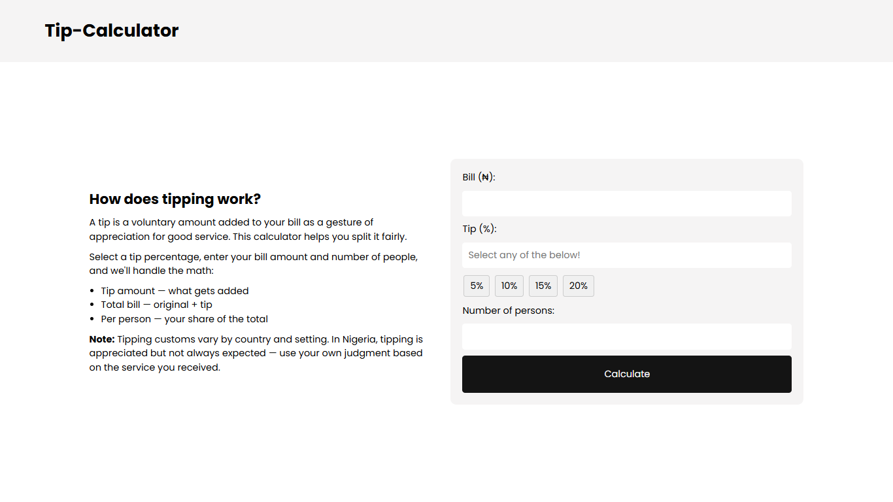
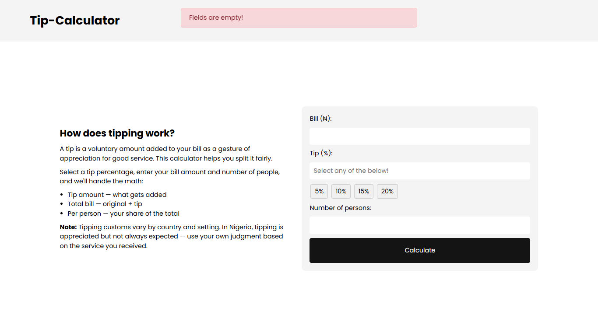
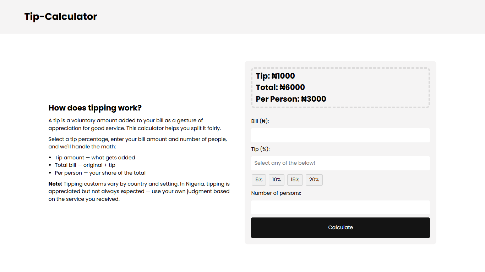

# Tip Calculator

A fast, mobile-friendly tip calculator that splits bills fairly
between any number of people.

## Live Demo

[Link here once deployed]

## Screenshot

**Default Form State:**


**No-Input Error State:**


**Invalid Errorm State:**


**Calculated Result:**


## Features

- Preset tip buttons (5%, 10%, 15%, 20%)
- Calculates tip amount, total bill, and per-person share
- Handles decimal bill amounts (e.g. ₦1500.50)
- Validates empty inputs and zero/negative values
- Resets form after each calculation

## Tech Stack

HTML, CSS, JavaScript (no frameworks)

## What I Learned

- Radio button pattern using classList for mutually exclusive selection
- Returning multiple calculated values from a single function using an object
- parseFloat vs parseInt and when each is appropriate
- Resetting form state cleanly after submission

## Installation & Running Locally

Because this is a Vanilla JavaScript project without build tools, setup is extremely simple:

1. Clone the repository:
   ```bash
   git clone https://github.com/ifeanyi234/Tip-calculator.git
   cd Tip-calculator
   ```
   Open index.html directly in any modern web browser.

## Known Limitations

- No custom tip percentage input beyond the presets
- Currency formatting doesn't add thousand separators (e.g. ₦10,000)

## What I'd Improve With More Time

- Add a custom tip % input field
- Format currency with commas (Intl.NumberFormat)
- Add a reset button so user can start over without submitting
